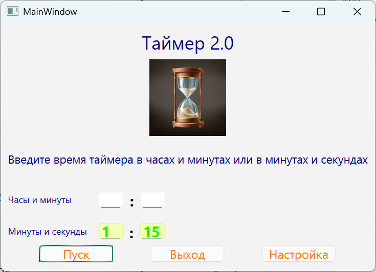
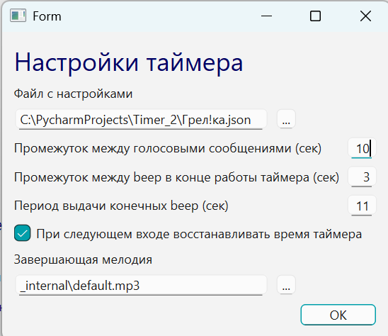

# Timer 2

Desktop-таймер обратного отсчёта на **Python + PyQt6**.

Программа предназначена для контроля упражнений и действий, которые выполняются строго заданное время: тренировочных подходов, лечебной гимнастики, дыхательных практик и других повторяемых задач.

Проект демонстрирует практическую desktop-разработку: Qt UI, валидацию ввода, хранение пользовательских настроек, точный таймер, голосовое оповещение, звуковой сигнал окончания таймера и сборку Windows-приложения через PyInstaller.

## Скриншоты

### Главное окно



### Окно настроек



## Что умеет приложение

* запуск таймера в двух режимах ввода времени:
  * часы + минуты;
  * минуты + секунды;
* защита от одновременного использования двух режимов ввода;
* восстановление последнего введённого времени и выбранных настроек;
* периодическое голосовое сообщение об оставшемся времени;
* звуковые сигналы в финальном периоде отсчёта;
* выбор пользовательской мелодии окончания таймера;
* хранение настроек в профиле пользователя, а не в каталоге программы;
* переключение между ранее сохранёнными наборами настроек.

## Стек

* Python 3.13+
* PyQt6
* pygame
* pyttsx3
* num2words
* pytest / mypy / ruff / black для разработки
* PyInstaller для сборки Windows-версии

> Рекомендуемая версия Python для проекта — **3.13**.
>
> Проект ориентирован на Windows.
>
> На Python 3.14 отдельные зависимости, например `pygame`, могут устанавливаться не из готового wheel-файла, а через сборку из исходников.

## Структура проекта

```text
.
├── src/
│   └── timer_2/
│       ├── __init__.py
│       ├── main.py                 # точка входа приложения
│       ├── clock.py                # логика обратного отсчёта
│       ├── precise_timer.py        # QTimer с компенсацией дрейфа
│       ├── inform.py               # голосовое и звуковое информирование
│       ├── tunes.py                # окно настроек
│       ├── tunes_model.py          # модель настроек
│       ├── tunes_dto.py            # DTO настроек
│       ├── tunes_mapper.py         # преобразование DTO/model
│       ├── tunes_storage.py        # хранение настроек
│       ├── tunes_defaults.py       # значения по умолчанию
│       ├── tune_key.py             # ключи настроек
│       ├── functions.py            # общие функции приложения
│       ├── const.py                # константы
│       └── signals.py              # Qt-сигналы приложения
├── _internal/                      # UI-файлы и ресурсы
├── tests/                          # unit-тесты
├── docs/                           # документация и изображения
├── examples/                       # пример файла настроек
├── requirements.txt                # runtime-зависимости
├── requirements-dev.txt            # зависимости для разработки
├── pyproject.toml                  # конфигурация проекта и инструментов
├── run_tests.bat                   # запуск тестов под Windows
└── timer_2.spec                    # сборка через PyInstaller
```

## Быстрый запуск из исходников под Windows

### Получение проекта

Перед запуском нужно получить исходные файлы проекта.

Все следующие команды нужно выполнять из корневой директории проекта — папки, куда был склонирован или распакован репозиторий.

#### Вариант 1. Через Git

Перейдите в директорию, где хотите разместить проект:

```cmd
cd /d <Ваша директория>
```

Склонируйте репозиторий:

```cmd
git clone https://github.com/LeonidBolshakov/Timer2.git
```

Перейдите в корневую директорию проекта:

```cmd
cd Timer2
```

#### Вариант 2. Через ZIP-архив

1. На странице репозитория GitHub нажмите **Code → Download ZIP**.
2. Распакуйте архив в удобную папку.
3. Откройте распакованную папку проекта в Проводнике Windows.
4. В адресной строке Проводника введите:

```cmd
cmd
```

### Создание виртуального окружения

```cmd
py -3.13 -m venv .venv
```

### Установка зависимостей приложения

```cmd
.venv\Scripts\python.exe -m pip install -U pip
.venv\Scripts\python.exe -m pip install -r requirements.txt
.venv\Scripts\python.exe -m pip install -e .
```

### Запуск приложения

```cmd
.venv\Scripts\python.exe -m timer_2.main
```

Важно: в командах ниже используется не просто `python`, а именно:

```cmd
.venv\Scripts\python.exe
```

Так гарантированно запускается Python из виртуального окружения проекта, а не системный Python из `PATH`.

## Зависимости для разработки

Для запуска тестов, Ruff, mypy, black и PyInstaller установите dev-зависимости:

```cmd
.venv\Scripts\python.exe -m pip install -r requirements-dev.txt
```

## Проверки проекта

Запуск тестов:

```cmd
.venv\Scripts\python.exe -m pytest -q
```

Или через bat-файл из корня проекта:

```cmd
run_tests.bat
```

Проверка синтаксической компиляции:

```cmd
.venv\Scripts\python.exe -m compileall src tests
```

Проверка Ruff:

```cmd
.venv\Scripts\python.exe -m ruff check src tests
```

Автоисправление части замечаний Ruff:

```cmd
.venv\Scripts\python.exe -m ruff check src tests --fix
```

Форматирование Ruff Formatter:

```cmd
.venv\Scripts\python.exe -m ruff format src tests
```

Проверка mypy:

```cmd
.venv\Scripts\python.exe -m mypy src tests
```

## Сборка Windows-приложения

Установить dev-зависимости:

```cmd
.venv\Scripts\python.exe -m pip install -r requirements-dev.txt
```

Запустить сборку:

```cmd
.venv\Scripts\python.exe -m PyInstaller timer_2.spec
```

Результат сборки появится в каталоге:

```text
dist/
```

## Настройки

Рабочие настройки сохраняются в профиле пользователя:

```text
%APPDATA%\Timer_2\profiles\user.json
```

В репозитории не должны храниться личные рабочие JSON-файлы пользователя.

Пример формата настроек:

```text
examples/settings.example.json
```

## Особенности

* GUI-приложение сделано не как один учебный скрипт, а как набор отдельных компонентов.
* Используется пакетная структура `src/timer_2`.
* Логика таймера отделена от окна приложения.
* Настройки вынесены в отдельный DTO/model/storage-слой.
* Есть защита от повреждённых файлов настроек.
* Есть unit-тесты для чистой бизнес-логики.
* Есть конфигурация инструментов разработки.
* Учтена сборка standalone-приложения через PyInstaller.

## Ограничения

* Проект ориентирован в первую очередь на Windows.
* Полноценные GUI-тесты не добавлены.
* Звуковое и голосовое информирование зависят от системных аудиоустройств и установленных голосовых движков Windows.
