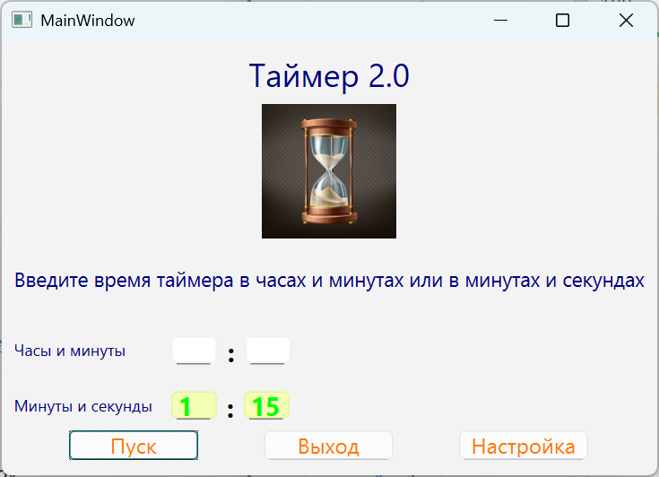
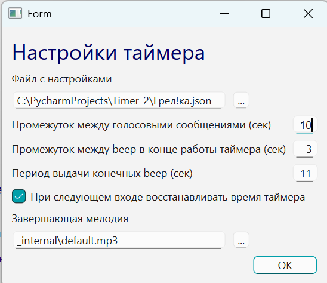

# Timer 3

Desktop-таймер обратного отсчёта для Windows на Python и PyQt6. Поддерживает обычный и циклический режимы, голосовые сообщения об оставшемся времени, финальные звуковые сигналы, пользовательскую мелодию и несколько JSON-профилей настроек.

Приложение подходит для тренировочных подходов, лечебной гимнастики, дыхательных практик и других задач, где важны точные интервалы.

## Скриншоты

### Главное окно

### Окно настроек

## Возможности

- обычный таймер с вводом времени в формате часы + минуты или минуты + секунды;
- циклический таймер из последовательности интервалов длительностью до 59 секунд;
- заданное число повторов цикла или бесконечное повторение;
- компенсация накопленного дрейфа системного таймера;
- периодическое голосовое сообщение об оставшемся времени;
- звуковые сигналы в финальной части отсчёта;
- выбор мелодии завершения;
- восстановление времени и выбранного режима при следующем запуске;
- переключение между JSON-профилями настроек;
- безопасное восстановление после отсутствующего или повреждённого файла настроек;
- сборка автономного Windows-приложения через PyInstaller.

## Требования

- Windows 10 или новее;
- Python 3.13 рекомендуется для разработки;
- рабочее устройство вывода звука;
- установленный голосовой движок Windows для голосовых сообщений.

Проект объявляет совместимость с Python 3.11+, но CI и основной сценарий разработки используют Python 3.13.

## Быстрый запуск

Все команды выполняются из корня репозитория.

    py -3.13 -m venv .venv
    .venv\Scripts\python.exe -m pip install -U pip
    .venv\Scripts\python.exe -m pip install -r requirements.txt
    .venv\Scripts\python.exe -m pip install -e .
    .venv\Scripts\python.exe -m timer_3.main

Альтернативная точка входа, используемая при сборке:

    .venv\Scripts\python.exe run_timer.py

## Режимы таймера

### Обычный таймер

Введите время только в одной паре полей:

- часы и минуты;
- минуты и секунды.

После нажатия **Пуск** приложение начинает обратный отсчёт. По завершении проигрывается выбранная мелодия, после чего приложение закрывается.

### Циклический таймер

Введите последовательность интервалов в секундах, например:

    30 10 30 10

Задайте число повторов всего цикла или включите бесконечное повторение. Во время работы отображаются номер интервала, его длительность и оставшееся время.

Подробное описание интерфейса и сценариев: [руководство пользователя](docs/USER_GUIDE.md).

## Настройки

Основной профиль создаётся автоматически:

    %APPDATA%\Timer_3\profiles\user.json

Служебный файл с указателем активного профиля:

    %APPDATA%\Timer_3\active_settings.json

Через окно настроек можно выбрать существующий JSON-файл или указать путь к новому. Полная схема и правила восстановления значений описаны в [документации настроек](docs/SETTINGS.md). Актуальный пример находится в [examples/settings.example.json](examples/settings.example.json).

## Проверка проекта

Установите зависимости разработчика:

    .venv\Scripts\python.exe -m pip install -r requirements-dev.txt

Запустите полный набор проверок:

    run_tests.bat
    .venv\Scripts\python.exe -m ruff check src tests
    .venv\Scripts\python.exe -m mypy src tests
    .venv\Scripts\python.exe -m compileall src tests

Для отчёта покрытия дополнительно установите Coverage.py:

    .venv\Scripts\python.exe -m pip install coverage
    .venv\Scripts\python.exe -m coverage run --source=timer_3 -m pytest
    .venv\Scripts\python.exe -m coverage report -m

Стратегия и устройство тестов: [docs/TESTING.md](docs/TESTING.md).

## Сборка Windows-приложения

    .venv\Scripts\python.exe -m pip install -r requirements-dev.txt
    build_exe.bat

Результат:

    dist\timer_3\timer_3.exe

Сценарий сборки удаляет старые каталоги build и dist, затем запускает PyInstaller с файлом timer_3.spec.

## Структура проекта

    src/timer_3/
        main.py                 главное окно и точка входа
        timer_controller.py     сценарии обычного и циклического таймеров
        timer_configurator.py   валидаторы, сигналы и начальное состояние UI
        clock.py                обратный отсчёт и события тика/завершения
        precise_timer.py        компенсация дрейфа QTimer
        inform.py               голос и финальная мелодия
        context.py              фасад модели и хранилища настроек
        model.py                рабочая модель настроек
        dto.py                  JSON-совместимое представление
        mapper.py               преобразование DTO, Model и JSON
        storage.py              профили и безопасная работа с файлами
        tunes.py                окно настроек
        tunes_controller.py     обработчики окна настроек
        tunes_configurator.py   валидаторы и связи сигналов настроек
        focus_transition.py     схемы клавиатурного фокуса
    tests/                      unit- и компонентные тесты
    _internal/                  UI-файлы, иконка и звуковые ресурсы
    docs/                       документация и изображения
    examples/                   пример JSON-профиля

## Документация

- [Руководство пользователя](docs/USER_GUIDE.md)
- [Настройки и JSON-схема](docs/SETTINGS.md)
- [Архитектура](docs/ARCHITECTURE.md)
- [Разработка и сборка](docs/DEVELOPMENT.md)
- [Тестирование](docs/TESTING.md)

## Ограничения

- приложение ориентировано прежде всего на Windows;
- голос и звук зависят от системных аудиокомпонентов;
- длительность отдельного интервала циклического таймера ограничена 59 секундами;
- автоматические тесты проверяют логику и связи UI, но не заменяют ручную проверку реального звука и полного desktop-сценария.
